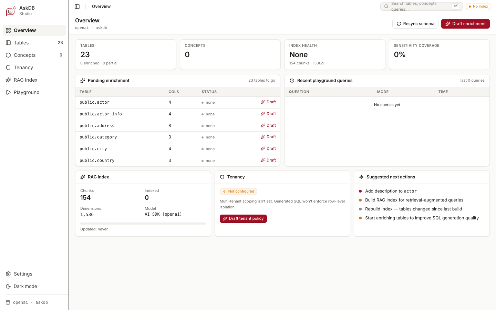
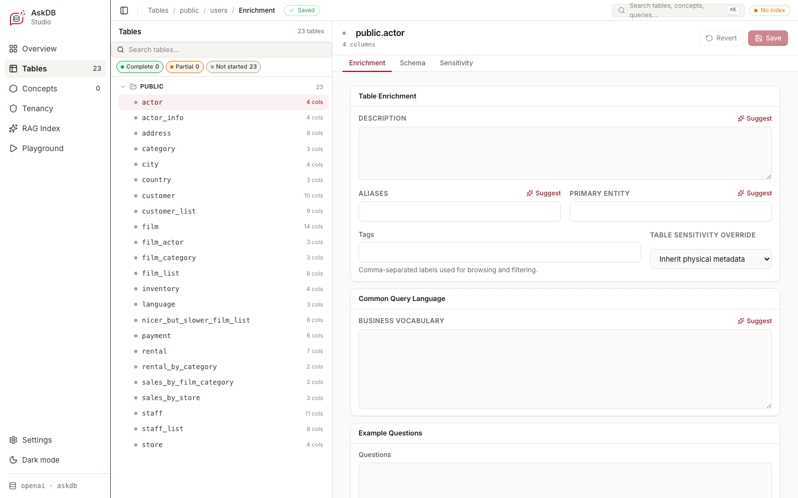
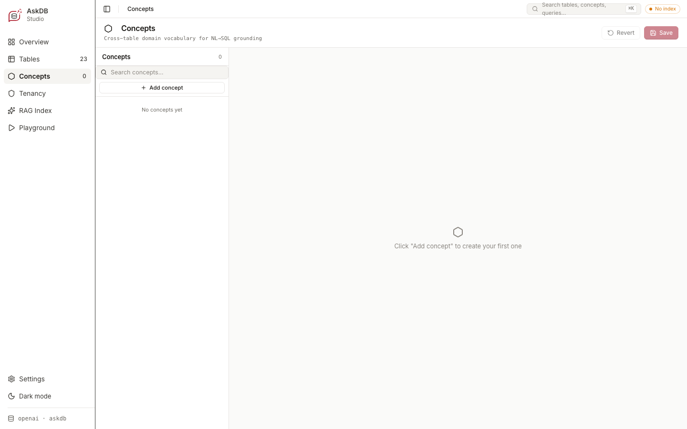
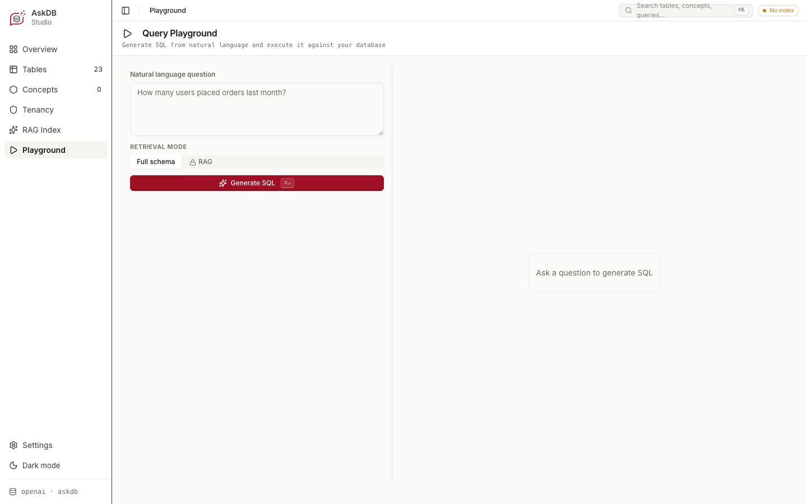
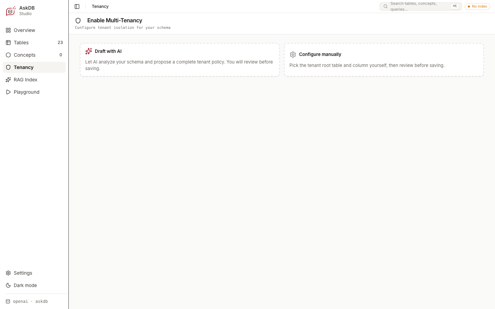

<p class="doc-eyebrow">Visual tour</p>

<p class="doc-lede">Studio is a local web app that reads and writes your schema artifact directly — nothing leaves your machine. Launch it from your project root and your browser opens a seven-view UI for enriching tables, defining concepts, configuring tenant isolation, and testing natural-language questions against the SQL they generate.</p>

```bash
npx askdb studio
```

Studio reads `outputDir` from `askdb.config.ts`. Pass `--schema <path>` to override for a single run. By default it serves on `http://127.0.0.1:5556`.

## The loop

The core Studio workflow is **enrich → ask → re-enrich**: add descriptions, aliases, and example questions to a table, then switch to the Playground and ask a question to see the generated SQL. If the answer isn't what you expected, go back, tighten the enrichment, and re-ask — all without leaving the browser tab. Repeating this loop is what makes generation reliable for the vocabulary your team actually uses.

## Overview



The Overview dashboard shows the health of your schema artifact at a glance: how many tables are enriched, how many are still at the default "none" state, RAG index status (chunk count and model), tenancy configuration, and a prioritised list of suggested next actions. Use it as your starting point to see where enrichment effort will have the most impact.

## Tables and enrichment



The Tables view lists every physical table in your schema. Select a table to open its detail panel with three tabs:

- **Enrichment** — write a description, set aliases (the names users actually use when asking questions), declare a primary entity, add comma-separated tags, capture business vocabulary in the Common Query Language field, and add example questions.
- **Schema** — view the raw column list with types and nullability.
- **Sensitivity** — mark columns like `email`, `ssn`, or `internal_notes` as sensitive so the prompt layer can tag or omit them.

Each field has a **Suggest** button: provide a model key and Studio drafts a proposal for your review. Suggestions are never applied automatically — a human confirms every change before it lands in the artifact.

## Concepts



Concepts capture cross-table business vocabulary that doesn't map to a single table — things like "active subscription", "paid order", or "customer" in a schema where that meaning spans several joined tables. Add a concept, write a description, and the model uses it when constructing prompts. Start with the terms your team reaches for most when they talk about the data.

## Playground



The Query Playground is where you test whether your enrichment is working. Type a question in plain language, choose between **Full schema** (send the entire enriched artifact) or **RAG** (retrieve only the relevant chunks), and click **Generate SQL**. The generated SQL appears alongside the retrieval context so you can see exactly what the model was given. If the SQL is wrong, the enrichment fields that need fixing are usually obvious from the context shown.

## Tenancy



The Tenancy view is where you declare tenant isolation for multi-tenant schemas. Choose **Draft with AI** to let Studio analyse your schema and propose a tenant policy for your review, or **Configure manually** to pick the tenant root table and column yourself. Once configured, the Playground enforces tenant scope on every generated query and lets you test with different tenant IDs. See [Multi-tenancy](/guides/multi-tenancy/) for the full walkthrough.

## Studio and your data

Studio binds to `127.0.0.1` by default — it is not reachable from outside your machine without an explicit host override. The model only ever sees schema text (table names, column names, descriptions, concepts): it never reads your actual rows. AI features — enrichment suggestions, tenant policy drafts, NL→SQL generation — are optional and only active when a model API key is configured in your environment.

## Read next

<div class="home-path-grid">
  <a href="/quickstart/"><strong>Quickstart</strong><span>Scaffold config, introspect a database, and run Studio end-to-end in under five minutes.</span></a>
  <a href="/guides/author-your-schema/"><strong>Author your schema</strong><span>The full enrichment workflow — descriptions, concepts, sensitive markers, and tenant policy.</span></a>
  <a href="/guides/multi-tenancy/"><strong>Multi-tenancy</strong><span>Declare tenant roots and row-level isolation in your schema artifact.</span></a>
  <a href="/guides/rag-for-large-schemas/"><strong>RAG for large schemas</strong><span>When your enriched artifact is too large for a single prompt context.</span></a>
</div>
