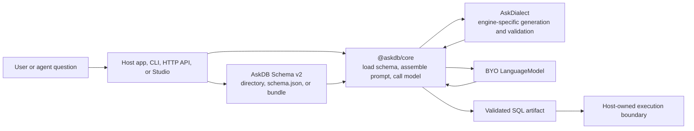
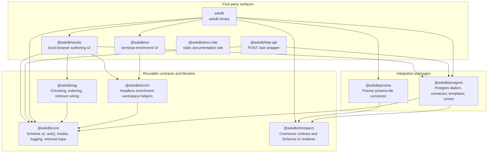
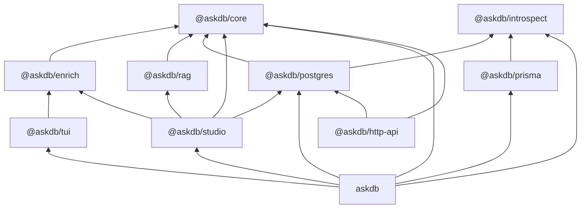
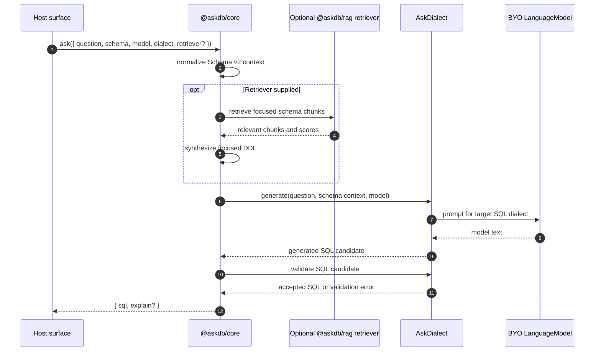
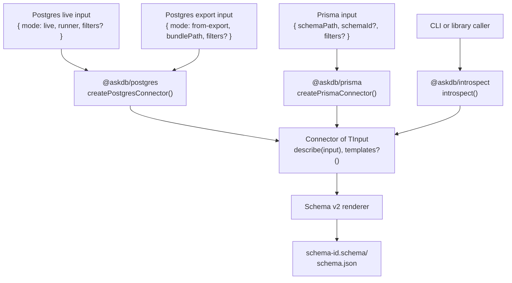
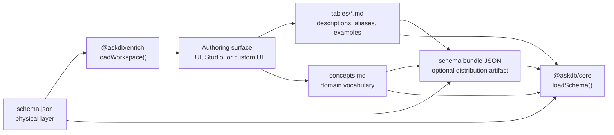
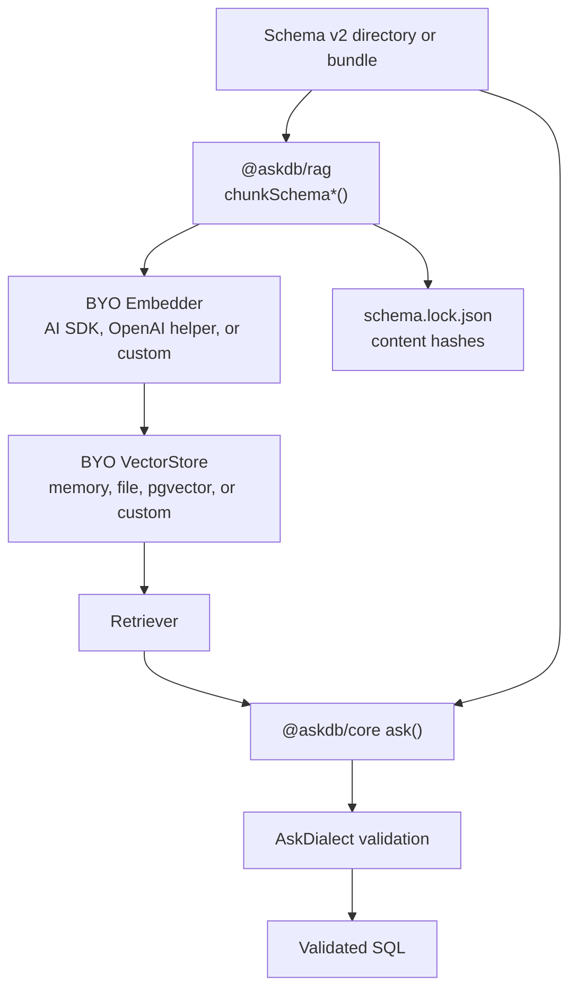

# AskDB Architecture

This document is the canonical architecture guide for AskDB packages, package boundaries, install profiles, and extension seams. It complements the package READMEs, [Platform](platform.md), [Schema v2](contracts/schema-v2.md), and [Connector authoring](integration/connectors.md) docs.

## System overview

AskDB turns natural-language questions into schema-grounded SQL. The central runtime boundary is deliberate: AskDB returns SQL for review; the host application owns approval, execution, database roles, tenant policy, network controls, and audit logging.

`@askdb/core` is dialect-agnostic. It does not import database drivers, does not own live database connections, and does not execute generated SQL. Database-specific behavior is supplied through integration packages such as `@askdb/postgres`.

## Package map

AskDB is a pnpm monorepo with reusable packages under `packages/*` and first-party product surfaces under `apps/*`. Some packages publish binaries, but their package boundary still follows the same rule: reusable contracts live in libraries and integrations; product workflows compose those contracts.

| Package | Purpose and scope | Boundary |
| --- | --- | --- |
| `@askdb/core` | Dialect-agnostic NL-to-SQL pipeline, Schema v2 loading/parsing, modes, logging, enrichment suggestions, and retriever input. | No database drivers, no generated-SQL execution, no engine-specific connector. |
| `@askdb/introspect` | Engine-agnostic `Connector<TInput>` contract, introspection orchestrator, and Schema v2 renderer. | No default connector, no engine-specific input union, no standalone binary. |
| `@askdb/postgres` | Postgres dialect, SQL prompt/validation helpers, live/from-export connector, catalog templates, and optional `pg` catalog runner. | `pg` is optional and only needed for live catalog reads; generated SQL still executes outside AskDB. |
| `@askdb/prisma` | Offline Prisma schema-file connector that renders Schema v2 physical metadata. | No live database connection and no SQL dialect. Pair output with a dialect such as `postgresDialect` when generating SQL. |
| `@askdb/enrich` | Headless Schema v2 authoring helpers: load/save workspace, table drafts, concepts, markdown preservation, suggestions, and bundling. | No terminal or browser UI. |
| `@askdb/tui` | Maintained terminal authoring surface over a Schema v2 directory. | Operates on files; does not introspect or connect to databases. |
| `@askdb/studio` | Maintained local browser UI for enrichment, sample NL-to-SQL checks, and local RAG exploration. | Authoring surface over Schema v2, not a connector package. |
| `@askdb/rag` | Deterministic Schema v2 chunking, BYO embedder/store interfaces, in-memory/file/pgvector adapters, and retriever wiring. | Optional layer; prompt generation still flows through `@askdb/core` and a dialect. |
| `askdb` | Batteries-included `askdb` workflow for ask, introspect, enrich, studio, and bundle commands. | Product surface that composes packages; not the reusable contract layer. |
| `@askdb/http-api` | Minimal HTTP wrapper around `@askdb/core` that returns SQL from `POST /ask`. | No duplicate NL-to-SQL implementation and no SQL execution. |
| `@askdb/docs-site` | Static documentation site. | Mirrors selected docs content; Markdown files remain canonical for architecture and contracts. |

## Dependency boundaries

The package graph is intentionally layered by responsibility.

Boundary rules:

- `@askdb/core` remains the schema and NL-to-SQL contract package. It receives a dialect, a model, an optional retriever, and a schema; it returns SQL.
- Integration packages own engine-specific knowledge. `@askdb/postgres` owns Postgres dialect behavior and Postgres catalog introspection. `@askdb/prisma` owns Prisma schema-file introspection.
- `@askdb/introspect` does not know whether an integration reads a live database, an export bundle, a file, or a future API. The connector input shape belongs to the connector package.
- `@askdb/enrich` owns reusable authoring behavior. `@askdb/tui` and `@askdb/studio` depend on it instead of depending on each other.
- `@askdb/rag` is optional. It can narrow schema context before `ask()`, but it does not replace dialect validation.
- First-party apps can be batteries-included. Reusable packages should stay small and should not pull optional drivers into unrelated workflows.

## Schema-to-SQL flow

The generated SQL is an output artifact. Running it is outside the AskDB package API by design.

## Introspection connector architecture

`@askdb/introspect` defines the connector contract and rendering flow. Connector packages supply the engine-specific source reader and input type.

Connector capability matrix:

| Connector package | Input source | Live database | Export or offline mode | Dialect included | Optional peers |
| --- | --- | --- | --- | --- | --- |
| `@askdb/postgres` | PostgreSQL catalog metadata. | Yes, through a caller-supplied `CatalogQueryRunner` or `createPostgresCatalogQueryRunner()`. | Yes, through from-export bundles produced from the catalog templates. | Yes, `postgresDialect`. | `pg` for live introspection. |
| `@askdb/prisma` | One `schema.prisma` file or a directory of `.prisma` files. | No. | Yes, file-only introspection. | No. | None declared. |

## Enrichment flow

Introspection produces the physical layer. Enrichment authoring adds the describable layer that humans and RAG use for better grounding.

`@askdb/tui` and `@askdb/studio` are maintained enrichment surfaces. They do not own the shared workspace logic and they do not need a live database connection to edit enrichment.

## RAG flow

RAG is an optional layer for large enriched schemas. It indexes Schema v2 chunks with consumer-selected embeddings and storage, then returns a retriever for `ask()`.

Sensitive describable-layer content is excluded from RAG chunks by default. Identifier grounding and dialect guardrails remain part of the core SQL generation path.

## Install profiles

In the table below, "selected packages" are packages the consumer chooses for a workflow. "Automatically installed" means normal package dependencies pulled in by those selected packages. "Optional peers" are peer packages the consumer installs only when using a feature that needs them.

| Workflow | Selected packages | Automatically installed by those packages | Optional peers or provider packages | Notes |
| --- | --- | --- | --- | --- |
| Minimal Postgres SQL generation | `@askdb/core`, `@askdb/postgres` | `@askdb/postgres` pulls `@askdb/core`, `@askdb/introspect`, and `ai` as package dependencies. | Add a model provider such as `@ai-sdk/openai` when your runtime creates the model directly. Add `@askdb/ai` plus a provider adapter such as `@askdb/ai-openai` only if you want AskDB config/env model factories. `pg` is not needed. | Uses `ask()` plus `postgresDialect`; SQL execution remains host-owned. |
| Live Postgres introspection | `@askdb/introspect`, `@askdb/postgres` | `@askdb/postgres` pulls `@askdb/core` and `@askdb/introspect`. | `pg` for `createPostgresCatalogQueryRunner()`. | Callers can also supply their own `CatalogQueryRunner`. |
| Air-gapped Postgres introspection | `@askdb/introspect`, `@askdb/postgres` | Same as live Postgres introspection. | No `pg` required if using from-export bundles only. | Templates come from `POSTGRES_TEMPLATE_BUNDLE`. |
| Prisma schema-file introspection | `@askdb/introspect`, `@askdb/prisma` | `@askdb/prisma` pulls `@askdb/introspect` and `@prisma/internals`. | No database driver peer declared. | Produces Schema v2 physical metadata from Prisma files; no dialect included. |
| CLI workflow | `askdb` | Pulls first-party integrations and surfaces used by the `askdb` binary, including core, ai, provider adapters, introspect, postgres, prisma, studio, tui, and `pg`. | Environment variables choose which runtime paths are active. | Batteries-included product surface, not the smallest library install. |
| Terminal enrichment | `@askdb/tui` | Pulls `@askdb/core`, `@askdb/ai`, provider adapters, `@askdb/enrich`, Ink, and React. | `OPENAI_API_KEY` enables suggestions; manual authoring works without live suggestions. | Operates on Schema v2 files only. |
| Local browser Studio | `@askdb/studio` | Pulls core, ai, provider adapters, enrich, postgres, rag, and React UI dependencies. | `OPENAI_API_KEY` enables suggestions/sample generation; RAG provider choices are runtime config. | Local authoring UI, sample SQL checks, and local RAG exploration. |
| RAG with memory or file store | `@askdb/rag`, `@askdb/core` | `@askdb/rag` pulls `@askdb/core`. | Embedder packages only if using a helper such as OpenAI. | In-memory and file stores do not need `pg`. |
| RAG with pgvector | `@askdb/rag`, `@askdb/core` | `@askdb/rag` pulls `@askdb/core`. | `pg` when using the pgvector adapter with a Postgres connection; embedding provider package as needed. | Vector storage is optional and selected by the host. |

## Connectors vs peer packages

Connectors and peer packages solve different problems:

- A connector is an AskDB integration package that knows how to describe a schema source. Examples: `@askdb/postgres` and `@askdb/prisma`.
- A peer package is a runtime dependency the consumer installs only when the chosen feature needs it. Examples: `pg` for live Postgres catalog reads, `pg` for pgvector, and AI SDK provider packages for model or embedding helpers.
- Installing `@askdb/core` does not select a database. The caller chooses a dialect package for SQL generation and a connector package for schema introspection.
- Installing an authoring surface such as `@askdb/tui` or `@askdb/studio` does not make it a connector. Those surfaces edit Schema v2 artifacts.

## Extension points

| Extension point | Package | Shape | When to implement |
| --- | --- | --- | --- |
| SQL dialect | `@askdb/core` consumer API, implemented by integrations | `AskDialect` | Add a database dialect or a different SQL-generation/validation policy. |
| Introspection connector | `@askdb/introspect` contract, implemented by integrations | `Connector<TInput>` | Add a new schema metadata source such as another database engine, export format, or schema file type. |
| Catalog runner | Integration-owned helper, currently `@askdb/postgres` | `CatalogQueryRunner` | Use a different live database client while keeping the connector unchanged. |
| Enrichment authoring | `@askdb/enrich` | `Workspace`, draft builders, save helpers, bundle helpers | Build a custom UI over Schema v2 without depending on TUI or Studio. |
| Retrieval | `@askdb/rag` and `@askdb/core` | `Embedder`, `VectorStore`, `Retriever` | Use a different embedding provider, vector database, or retrieval policy. |
| Product surface | App packages or consumer app | CLI, HTTP, browser UI, MCP, future SDK | Compose the reusable packages into a workflow with host-owned auth, policy, and execution. |

## Related docs

- [Installable package guide](integration/installable-package.md)
- [Connector authoring](integration/connectors.md)
- [Schema v2 contract](contracts/schema-v2.md)
- [Modes and sensitive fields](contracts/sensitive-fields-and-modes.md)
- [ADR 0002: Integration-package layout](adrs/0002-integration-package-layout.md)
- [ADR 0004: Enrichment-package boundary](adrs/0004-enrichment-package-boundary.md)
